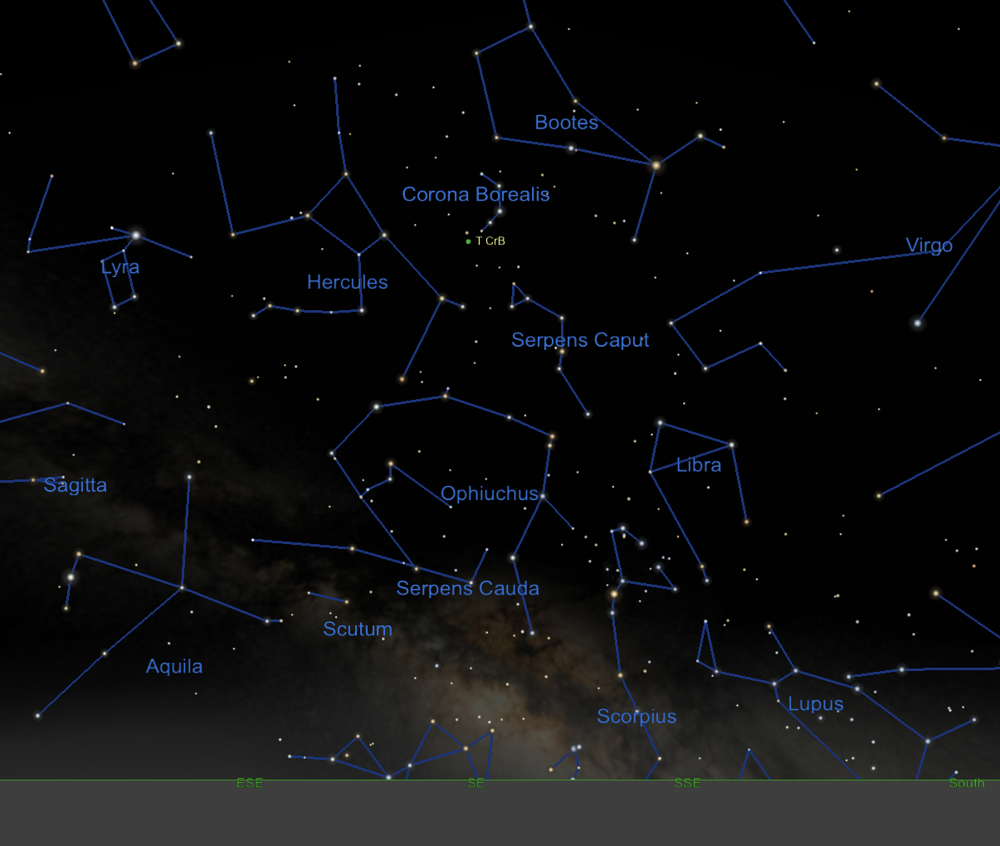

# Astronomy/T Corona Borealis Goes Kablooie

Auroras / T Corona Borealis "Hot Links"

## Auroras / T Corona Borealis *"Hot Links"*

| [NOAA / NWS Space Weather Prediction Center](https://www.spaceweather.gov/homepage)[^11] |
|---|
| [Ars Technica • Science](https://arstechnica.com/science/) |
| [The Lighter Side of Science / IFLScience](https://www.iflscience.com/) |
| [Inverse • Science](https://www.inverse.com/science)
| [PHYS • News of: Space, Astronomy, Space Exploration](https://phys.org/space-news/) |
| [ScienceAlert](https://www.sciencealert.com/) |
| [Space](https://www.space.com/) |
| [The Sun Spot - NASA](https://blogs.nasa.gov/sunspot/) |

[^11]: Links to get ready access to new news articles on solar flares that may bring the Aurora Borealis down to South Carolina, and also, T Corona Borealis for when it goes **KABLOOIE!**

["Horrendous Space Kablooie": Calvin and Hobbes' Name for the Big Bang was Embraced by Real Scientists](https://screenrant.com/calvin-hobbes-big-bang-horrendous-space-kablooie/) • August 1, 2023 @ [ScreenRant](https://screenrant.com/)

### Latest data of T Corona Borealis from AAVSO

[AAVSO -- WebObs Search Results for TCrB](https://app.aavso.org/webobs/results/?star=000-BBW-825&num_results=200&page=1)

### Compilation of T Corona Borealis Links to Articles

| T Corona Borealis | Date |
|---|---|
| [You Can Watch a Once-in-a-Lifetime Cosmic Explosion From Your Own Backyard - CNET](https://www.cnet.com/science/witness-this-rare-cosmic-explosion-thats-about-to-rock-earths-sky/) | July 22, 2024 4:14 p.m. PT |
| [Witness the Blaze Star: A Rare Nova Explosion Visible from Earth • Geek Side](https://geeksided.com/posts/witness-the-blaze-star-a-rare-nova-explosion-visible-from-earth-01j381v75m9p) | Jul 20, 2024 |
| [T Coronae Borealis star nova expected to happen in 2024 / Entertainment/Life / theadvocate.com](https://www.theadvocate.com/baton_rouge/entertainment_life/the-t-coronae-borealis-star-nova-expected-to-happen-soon/article_c3f3e260-3d40-11ef-87c6-8ba5b441f774.html) | Jul 12, 2024 |
| [UQ physicist explains T Coronae Borealis star explosion / news.com.au — Australia’s leading news site](https://www.news.com.au/technology/science/space/t-coronae-borealis-star-ready-to-release-massive-thermonuclear-explosion/news-story/5803c5fde05c2ced5130eea484bbf20b) | July 12, 2024 - 3:11PM |
| [Stargazing? Catch a glimpse of the sparkling T Coronae Borealis; stay spellbound](https://www.bizzbuzz.news/trendz/stargazing-catch-a-glimpse-of-the-sparkling-t-coronae-borealis-stay-spellbound-1327979) | 12 July 2024 1:09 PM IST |
| [T Coronae Borealis - the Blaze Star - Astronomical Society of Edinburgh](https://www.astronomyedinburgh.org/2024/07/10/t-coronae-borealis-the-blaze-star/#) | 10 July 2024 |
| [Blaze Star: nova from stellar explosion visible for the first time in 80 years • Cosmos Magazine](https://cosmosmagazine.com/space/astronomy/blaze-star-t-coronae-borealis/) | July 8, 2024 |
| [Exploding nova T Coronae Borealis could be on show for the first time in 80 years. Here's how to spot it - ABC News / Australia](https://www.abc.net.au/news/science/2024-07-10/t-coronae-borealis-nova-australia-explosion/104059134) | July 9, 2024 |
| [A once-in-a-lifetime explosion is about to create a 'new' star in the sky • Phys](https://phys.org/news/2024-07-lifetime-explosion-star-sky.html) | JULY 9, 2024 |
| [Look up! A once-in-a-lifetime explosion is about to create a ‘new’ star in the sky • The Conversation](https://theconversation.com/look-up-a-once-in-a-lifetime-explosion-is-about-to-create-a-new-star-in-the-sky-233884) | July 8, 2024 10:49pm EDT |
| [A rare stellar explosion will soon reveal a ‘new’ star. Here’s how to see it. / University of Pittsburgh](https://www.pitt.edu/pittwire/features-articles/corona-borealis-nova-explosion) | July 8, 2024 |
| [Nova eruption of V1716 Sco inspected in X-rays and gamma rays • Phys](https://phys.org/news/2024-07-nova-eruption-v1716-sco-rays.html) | JULY 4, 2024 |
| [‘Once in a lifetime event’: rare chance to see explosion on dwarf star 3,000 light years away / Astronomy • The Guardian](https://www.theguardian.com/science/article/2024/jul/05/t-coronae-borealis-blaze-star-dwarf-australia-how-to-see-nasa-usyd) | Thu 4 Jul 2024 11.00 EDT |
[This new star will soon be visible in Windsor's night sky, for the 1st time in 80 years / CBC News](https://www.cbc.ca/news/canada/windsor/nova-t-coronae-borealis-steve-pellarin-astronomy-girl-guides-stars-constellations-1.7253766) | Jul 04, 2024 4:00 AM EDT |
| [We Might Witness A Star Explode Soon — And It’s Not Betelgeuse • Inverse](https://www.inverse.com/science/star-supernova-explosion-how-to-see) | UPDATED: JULY 3, 2024 ORIGINALLY PUBLISHED: MARCH 20, 2024 |
| [NASA: 'Once-in-a-lifetime' nova eruption could happen any day • VOA](https://www.voanews.com/a/nasa-once-in-a-lifetime-nova-eruption-could-happen-any-day/7683941.html) | July 03, 2024 2:01 PM |
| [Exploding star to appear in night sky for first time in 80 years / The Independent](https://www.independent.co.uk/space/blaze-star-explosion-corona-borealis-nasa-b2572400.html) | July 2, 2024 |
| [Cosmic Fireworks, Close Encounters Among Spectacular Shortlist For Astronomy Photographer Of The Year / IFLScience](https://www.iflscience.com/cosmic-fireworks-close-encounters-among-spectacular-shortlist-for-astronomy-photographer-of-the-year-74904) | July 2, 2024 |
| [TCrB Charts and Photometry Tables / aavso](https://www.aavso.org/tcrb-charts-photometry-tables) | Tuesday, July 2, 2024 - 21:41 |
| [T Coronae Borealis nova to be visible in 2024 after eight decades • Interesting Engineering](https://interestingengineering.com/space/t-coronae-borealis-nova-visible-80-years) | Jul 01, 2024 10:45 AM EST |
| [A stellar explosion may create a temporary ‘new star’ this summer • Science News](https://www.sciencenews.org/article/stellar-explosion-nova-new-star-summer) | JULY 1, 20 X24 AT 11:30 AM |
| [How to win the fight against light pollution • Astronomy](https://www.astronomy.com/science/how-to-win-fight-against-light-pollution/) | Published: July 1, 2024 Last updated on July 2, 2024 |
| [July's night sky notes: A hero, a crown, and possibly a nova • Phys](https://phys.org/news/2024-07-july-night-sky-hero-crown.html) | JULY 1, 2024 |
| [Starwatch: a 2,600-year wait to see T Coronae Borealis explosion / Science / The Guardian](https://www.theguardian.com/science/article/2024/jul/01/starwatch-a-2600-year-wait-to-see-t-coronae-borealis-explosion) | Mon 1 Jul 2024 01.00 EDT |
| [Once-in-a-lifetime star explosion, visible from Earth, could happen any day now / Space](https://www.space.com/the-universe/stars/once-in-a-lifetime-star-explosion-visible-from-earth-could-happen-any-day-now) | July 1, 2024 |
| [This Week's Sky at a Glance, June 28 – July 7 - Sky & Telescope - Sky & Telescope](https://skyandtelescope.org/astronomy-news/observing-news/this-weeks-sky-at-a-glance-june-28-july-7/) | JUNE 28, 2024 |
| [Is the "Blaze Star" About to Blow? You May Be the First to Know - Sky & Telescope - Sky & Telescope](https://skyandtelescope.org/astronomy-news/is-the-blaze-star-about-to-blow-you-may-be-the-first-to-know/) | JUNE 26, 2024 |
| [Inside the life and death of stars : Short Wave : NPR (14 minute listen\) • NPR](https://www.npr.org/2024/06/24/1250455734/stars-nasa-life-death-nova) | JUNE 25, 2024 3:00 AM ET |
| [T Coronae Borealis and asteroid (2\) Pallas conjunction: image of the event and time-lapse - 24 June 2024. - The Virtual Telescope Project 2.0](https://www.virtualtelescope.eu/2024/06/25/t-coronae-borealis-and-asteroid-2-pallas-conjunction-image-of-the-event-and-time-lapse-24-june-2024/) | 06/25/2024 |
| [Once-in-a-lifetime nova will appear in Earth's sky. Here's how to spot it. • Yahoo](https://www.yahoo.com/news/once-in-a-lifetime-nova-will-appear-in-earths-sky-heres-how-to-spot-it-130449291.html) | Tue, June 25, 2024 at 9:04 AM EDT |
| [How to See 'Once-in-a-Lifetime' Nova Explosion over US Skies - Newsweek](https://www.newsweek.com/new-star-night-sky-nova-corona-borealis-how-watch-1916449) | Published Jun 24, 2024 at 8:59 AM EDT Updated Jun 27, 2024 at 5:33 AM EDT |
| [Once-in-a-Lifetime Astronomy Event To Happen in Summer 2024 • My Modern Met](https://mymodernmet.com/t-corona-borealis-nova-2024/) | June 24, 2024 |
| [When will ‘new’ star, T Coronae Borealis appear? (Star Diary, 24 to 30 June 2024\) • Sky at Night Magazine](https://www.skyatnightmagazine.com/podcasts/star-diary-24-jun-2024) | June 23, 2024 at 3:00 am |
| [T Coronae Borealis and asteroid (2\) Pallas conjunction: an image - 22 June 2024. - The Virtual Telescope Project 2.0](https://www.virtualtelescope.eu/2024/06/23/t-coronae-borealis-and-asteroid-2-pallas-conjunction-an-image-22-june-2024/) | 06/23/2024 |
| [NASA: Nova Explosion to Be ‘Once-in-Lifetime’ Event in Night Sky • Voice of America](https://learningenglish.voanews.com/a/nasa-nova-explosion-to-be-once-in-lifetime-event-in-night-sky/7664089.html ) | June 23, 2024 |
| [Don’t Miss: Witness a “Once-in-a-Lifetime” Nova Explosion • SciTechDaily](https://scitechdaily.com/dont-miss-witness-a-once-in-a-lifetime-nova-explosion/) | JUNE 23, 2024 |
| [When a new star flares in the constellation Corona Borealis • Universe Today](https://universemagazine.com/en/new-star-in-the-constellation-corona-borealis-the-most-anticipated-astronomical-event-of-2024/) | June 21, 2024 |
| [A 'new star' will appear in the sky any night now. Here's how to watch the Blaze Star ignite. / Live Science](https://www.livescience.com/space/astronomy/a-new-star-could-appear-in-the-sky-any-night-now-heres-how-to-see-the-blaze-star-ignite) | June 20, 2024 |
| [The World Will Soon Witness "One Of The Rarest Space Events Of Our Lives" / IFLScience](https://www.iflscience.com/the-world-will-soon-witness-one-of-the-rarest-space-events-of-our-lives-74746) | June 20, 2024|
| [Rare Sky Explosion Coming Soon: A Once-in-a-Lifetime Event Visible to The Naked Eye : ScienceAlert](https://www.sciencealert.com/rare-sky-explosion-coming-soon-a-once-in-a-lifetime-event-visible-to-the-naked-eye) | 19 June 2024 |
| [Waiting for T Coronae Borealis (T CrB\) to erupt: what could we see? - The Virtual Telescope Project 2.0](https://www.virtualtelescope.eu/2024/06/18/waiting-for-t-coronae-borealis-to-erupt-what-could-we-see/) | 06/18/2024 |
| [Rare Nova Event Will Be Visible To Naked Eye From 3,000 Light-Years Away; Here's Where To Look - Science • Mashable](https://in.mashable.com/science/77299/rare-nova-event-will-be-visible-to-naked-eye-from-3000-light-years-away-heres-where-to-look) | June 18, 2024 |
| [Nova explosion of nearby star will soon light up Earth's skies - Earth.com](https://www.earth.com/news/t-coronae-borealis-nova-explosion-nearby-star-light-up-earths-skies/) | 06-15-2024 |
| [Spaceweather.com Time Machine](https://spaceweather.com/archive.php?view=1&day=27&month=06&year=2024) –  TCrB | June 15, 2024 |
| [A Star That Exploded 40 Years Ago Is Breaking The Rules, Scientists Call It A Treasure - Science • Mashable](https://in.mashable.com/science/77101/a-star-that-exploded-40-years-ago-is-breaking-the-rules-scientists-call-it-a-treasure) | June 13, 2024 |
| [A new star in the sky might be the 'brightest nova of the generation' • Astronomy](https://www.astronomy.com/observing/how-to-see-t-coronae-borealis-the-brightest-nova-of-the-generation/) | June 12, 2024 |
| [T Coronae Borealis Explosion / When Is the Nova Explosion 2024 / Supernova 2024 / Star Walk](https://starwalk.space/en/news/t-coronae-borealis-nova-star-exploding) | Jun 13, 2024 |
| [A 'new star' could appear in the sky any night now. Here's how to see the Blaze Star ignite. / Space](https://www.livescience.com/space/astronomy/a-new-star-could-appear-in-the-sky-any-night-now-heres-how-to-see-the-blaze-star-ignite) | June 10, 2024 |
| [Blaze Star to go nova soon! Here’s how to see it • Earth Sky](https://earthsky.org/space/a-new-star-from-a-nova-outburst-is-expected-soon/) | June 7, 2024 |
| [Astronomers Await Visible Nova Event in Corona Borealis • Space Daily](https://www.spacedaily.com/reports/Astronomers_Await_Visible_Nova_Event_in_Corona_Borealis_999.html) | Jun 07, 2024 |
| [T Coronae Borealis: an image, waiting for its eruption - 7 June 2024 - The Virtual Telescope Project 2.0](https://www.virtualtelescope.eu/2024/06/07/t-coronae-borealis-an-image-waiting-for-its-eruption-7-june-2024/) | 06/07/2024 |
| [NASA Says Extremely Rare Nova Explosion Will Be Visible on Earth, Can Be Seen With Naked Eyes / Tech Times](https://www.techtimes.com/articles/305462/20240607/nasa-extremely-rare-nova-explosion-will-visible-earth-seen.htm) | Jun 7, 2024 9:19AM EDT |
| [NASA, global astronomers await rare nova explosion • Phys](https://phys.org/news/2024-06-nasa-global-astronomers-await-rare.html) | JUNE 7, 2024 |
| [NASA, Global Astronomers Await Rare Nova Explosion - NASA](https://www.nasa.gov/centers-and-facilities/marshall/nasa-global-astronomers-await-rare-nova-explosion/) | JUN 06, 2024 |
| [A rare nova is set to dazzle Australia’s skies any day now • Time Out](https://www.timeout.com/australia/news/a-rare-nova-is-set-to-dazzle-australias-skies-for-the-first-time-in-80-years-heres-how-you-can-see-it-060624) | Thursday 6 June 2024 |
| [A 'new star' could appear in the sky any night now. Here's how to see the Blaze Star ignite. / Live Science](https://www.livescience.com/space/astronomy/a-new-star-could-appear-in-the-sky-any-night-now-heres-how-to-see-the-blaze-star-ignite) | June 4, 2024 |
| [AI advances research into cosmic explosions • Space Daily](https://www.spacedaily.com/reports/AI_advances_research_into_cosmic_explosions_999.html) | Jun 04, 2024 |
| [New Star to Appear in Night Sky as T Corona Borealis Set for Nova Eruption • Space Daily](https://www.spacedaily.com/reports/New_Star_to_Appear_in_Night_Sky_as_T_Corona_Borealis_Set_for_Nova_Eruption_999.html) | Jun 04, 2024 |
| [Upcoming Nova in T Coronae Borealis: A Once-in-a-Lifetime Celestial Event • Daily Galaxy](https://dailygalaxy.com/2024/05/nova-coronae-borealis-celestial-event/) | May 30, 2024 14:48 |
| [How to see the nova (“new star”\) in Corona… / The Planetary Society](https://www.planetary.org/articles/how-to-see-the-nova-new-star-in-corona-borealis) | May 29, 2024 |
| [We're About To Witness A Stellar Event Potentially First Recorded In A Medieval Manuscript / IFLScience](https://www.iflscience.com/were-about-to-witness-a-stellar-event-potentially-first-recorded-in-a-medieval-manuscript-74360) | May 24, 2024 |
| [Nova explosion visible to the naked eye expected any day now / Ars Technica](https://arstechnica.com/science/2024/05/if-you-can-see-the-big-dipper-youll-get-to-see-a-star-go-nova-soon/) | 5/21/2024, 10:13 AM |
| [The famous Northern Crown is home to a future nova • Earth Sky](https://earthsky.org/tonight/in-a-dark-sky-look-for-the-northern-crown/) | May 17, 2024 |
| [Media Tip Sheet: The Return of the Blaze Star: T Coronae Borealis Set to Illuminate the Night Sky in 2024 / Media Relations / The George Washington  University](https://mediarelations.gwu.edu/media-tip-sheet-return-blaze-star-t-coronae-borealis-set-illuminate-night-sky-2024) | May 14, 2024 |
| [Life-Giving Phosphorus May Come From A Rare Type Of Nova / IFLScience](https://www.iflscience.com/life-giving-phosphorus-may-come-from-a-rare-type-of-nova-74179) | May 13, 2024 |
| [SETI Live: T Coronae Borealis - The Nova of a Lifetime • SETI Institute](https://www.seti.org/event/seti-live-t-coronae-borealis-nova-lifetime) | Thursday, May 09, 2024 2:30 PM - 3:00 PM |
| [The Jewel in the Crown / aavso](https://www.aavso.org/blog/T-CrB-jewel-in-the-crown) | Wednesday, May 1, 2024 - 14:43 |
| [Countdown Begins: Rare Nova Explosion to Grace Our Night Skies Before September! / Weather.com](https://weather.com/en-IN/india/space/news/2024-04-30-rare-nova-explosion-to-grace-our-night-skies-before-september) | 30 April, 2024 |
| [A new star is about to appear in the night sky. Here’s how to catch a glimpse / CU Boulder Today / University of Colorado Boulder](https://www.colorado.edu/today/2024/04/29/new-star-about-appear-night-sky-heres-how-catch-glimpse) | April 29, 2024 |
| [Q&A: How to catch a glimpse of a new star about to appear in the night sky • Phys](https://phys.org/news/2024-04-qa-glimpse-star-night-sky.html) | APRIL 29, 2024 |
| [This nova is on the verge of exploding. You could see it any day now. / Mashable](https://mashable.com/article/nova-outburst-new-star-coronae-borealis) | April 20, 2024 |
| [A Rare Nova Explosion Will Soon Bring a 'New Star' to the Night Sky—How to Catch a Glimpse / Smithsonian](https://www.smithsonianmag.com/smart-news/a-rare-nova-explosion-will-soon-bring-a-new-star-to-the-night-sky-how-to-catch-a-glimpse-180984186/) | April 19, 2024 |
| [Be the First to See a Once-in-a-Lifetime Stellar Explosion! • SETI Institute](https://www.seti.org/be-first-see-once-lifetime-stellar-explosion) | April 17 2024 |
| [Never seen an exploding star? This year, you'll have your chance : NPR](https://www.npr.org/2024/04/15/1244799763/nova-exploding-star-t-coronae-borealis) | APRIL 15, 2024 12:37 PM ET |
| [Blaze Star: Huge star explosion will be visible from Earth for a week - Earth.com](https://www.earth.com/news/t-coronae-borealis-blaze-star-explosion-visible-one-week/) | 04-13-2024 |
| [Nova explosion 2024 date approaches. Better than the eclipse? • Fast Company](https://www.fastcompany.com/91090893/nova-explosion-2024-date-approaches-t-coronae-borealis-better-than-eclipse) | 04-11-2024 |
| [Move Over Eclipse, a New Celestial Wonder Is Set to Take Center Stage • Gizmodo](https://gizmodo.com/move-over-eclipse-a-new-celestial-wonder-is-set-to-tak-1851399742) | April 10, 2024 |
| [Binary star system explosion is celestial wonder after solar eclipse • QZ](https://qz.com/binary-star-system-nova-explosion-solar-eclipse-1851400453) | April 10, 2024 |
| [A Giant Explosion in Space Will Happen This Year, And You Can See It : ScienceAlert](https://www.sciencealert.com/a-giant-explosion-in-space-will-happen-this-year-and-you-can-see-it) | 08 April 2024 |
| [Huge star explosion to appear in sky in once-in-a-lifetime event • Space Daily](https://www.spacedaily.com/reports/Huge_star_explosion_to_appear_in_sky_in_once-in-a-lifetime_event_999.html) | April 6, 2024 |
| [Huge star explosion to appear in sky in once-in-a-lifetime event • Phys](https://phys.org/news/2024-04-huge-star-explosion-sky-lifetime.html) | APR 6, 2024 |
| [Starwatch: Exploding nova promises rare sight in coming months / Astronomy / The Guardian](https://www.theguardian.com/science/2024/apr/08/starwatch-star-nova-t-coronae-borealis-visible) | Mon 8 Apr 2024 01.00 EDT Last modified on Mon 8 Apr 2024 04.17 EDT |
| [Nova explosion will be visible to naked eye in rare stargazing event • NBC News](https://www.nbcnews.com/science/space/nova-explosion-new-star-visible-naked-eye-rcna144511) | March 22, 2024, 7:00 AM EDT |
|  [NASA Says T Coronae Borealis Nova Set To Create a "New Star" in a Once-in-a-Lifetime Event - The Debrief](https://thedebrief.org/nasa-says-t-coronae-borealis-nova-set-to-create-a-new-star-in-a-once-in-a-lifetime-event/) | MARCH 20, 2024 |
| [Explosive nova will create a ‘new star’ in the night sky / CNN](https://www.cnn.com/2024/03/19/world/t-coronae-borealis-nova-new-star-scn/index.html) | 5:37 PM EDT, Tue March 19, 2024 |
| [Astrophysicist explains science behind once-in-a-lifetime nova outburst that will light up the sky this year • Phys](https://phys.org/news/2024-03-astrophysicist-science-lifetime-nova-outburst.html) | MARCH 19, 2024 |
| [Bright new ‘North star’ will soon burst into view – here’s how to see it • New Atlas](https://newatlas.com/space/bright-new-star-2024-nova/) | March 19, 2024 |
| [A new star in the sky might be the 'brightest nova of the generation' • Astronomy](https://www.astronomy.com/observing/how-to-see-t-coronae-borealis-the-brightest-nova-of-the-generation/)[^21] | March 18, 2024 |
| [When will T Coronae Borealis ignite in 2024? Expect a nova outburst soon – NBC4 Washington](https://www.nbcwashington.com/news/national-international/nova-explosion-2024-new-star/3566378/) | Published March 13, 2024   Updated on March 13, 2024 at 2:51 pm |
| [This Year Could Be A Once In A Lifetime Opportunity To See A Nova / IFLScience](https://www.iflscience.com/this-year-could-be-a-once-in-a-lifetime-opporthttps://www.iflscience.com/the-world-will-soon-witness-one-of-the-rarest-space-events-of-our-lives-74746unity-to-see-a-nova-73379) | March 13, 2024 |
| [A rare nova ignites a 'new star' in the sky this year. Here's how to see it / Space](https://www.space.com/new-star-night-sky-nova-explosion-rare) | March 12, 2024 |
| [A Nova in the Night Sky Will Make ‘a New Star’: How to See it. - The New York Times](https://www.nytimes.com/article/nova-new-star-t-coronae-borealis.html) | March 8, 2024 |
| [Once-in-a-Lifetime Viewing Opportunity: Nova Explosion, ‘New’ Star in Northern Crown • SciTechDaily](https://scitechdaily.com/once-in-a-lifetime-viewing-opportunity-nova-explosion-new-star-in-northern-crown/) | FEBRUARY 28, 2024 |
| [A Nova in the Making: Will T Coronae Borealis Pop in 2024? - Universe Today](https://www.universetoday.com/165451/a-nova-in-the-making-will-t-coronae-borealis-pop-in-2024/) | FEBRUARY 29, 2024 |
| [View Nova Explosion, ‘New’ Star in Northern Crown - Watch the Skies / NASA](https://blogs.nasa.gov/Watch_the_Skies/2024/02/27/view-nova-explosion-new-star-in-northern-crown/) | February 27, 2024 |
| [Three planets around this sun-like star are doomed • Phys](https://phys.org/news/2023-11-planets-sun-like-star-doomed.html)[^22] | NOVEMBER 1, 2023 |
| [A Medieval Manuscript Adds Credibility To Prediction Of A Nova Next Year • IFLScience](https://www.iflscience.com/a-medieval-manuscript-adds-credibility-to-prediction-of-a-nova-next-year-70802) | September 21, 2023 |
| [Medieval manuscript shows 'recurring nova' could reappear in 2024 / Space](https://www.livescience.com/space/astronomy/evidence-of-mysterious-recurring-nova-that-could-reappear-in-2024-found-in-medieval-manuscript-from-1217) | September 20, 2023 |
| [A medieval manuscript likely hides a record of an impending recurrent nova • Phys](https://phys.org/news/2023-09-medieval-manuscript-impending-recurrent-nova.html) | SEPTEMBER 11, 2023 |
| [Corona Borealis, the Northern Crown, in July • Earth Sky](https://earthsky.org/tonight/corona-borealis-the-northern-crown-2/) | July 21, 2023 |
| [Is T CrB rising? • Astronomy](https://www.astronomy.com/science/is-t-crb-rising/) | Published: July 6, 2020 Last updated on May 18, 2023 |
| [Timely Information About Upcoming Major Celestial Events - Astronomical League](https://www.astroleague.org/timely-information-about-upcoming-major-celestial-events/) | NO DATE |

[^21]: Typically, T CrB is not visible to the naked eye at a magnitude of 10. When it reaches peak brightness, T CrB will be comparable to Polaris, the North Star, which has a magnitude of 2. (The smaller the number, the brighter it is.) It should remain this bright for a few days to a week before vanishing again. When T CrB goes off, it will only be at maximum brightness for half a day before you must wait another 80 years to see it with your naked eyes. So go out and keep an eye on it!
[^22]: This Rho Corona Borealis, not T Corona Borealis. But they are in the same constellation.

## Astrophotography, Night Photography

[Astrophotography and Night Photography](../Photography/Astrophotography.md) has links to external content of articles and videos.

## Light Pollution

As rural areas of Lexington County, South Carolina, become suburban areas, the ability to enjoy the night sky is greatly diminished. Subdivisions in the design phase should be developed to preserve dark skies for stargazing, meteor showers, and viewing the International Space Station. Current subdivision currently in the design, development, and construction phases in Lexington County, South Carolina are producing light pollution that destroy the night sky.

### Light Pollution Remediations

#### Lighting Recommendations for New Subdivisions

DarkSky International restores the nighttime environment and protects communities from the harmful effects of light pollution through outreach, advocacy, and conservation.

What is light pollution?
Light pollution is the human-made alteration of outdoor light levels from those occurring naturally.

What are the effects?
Light pollution disrupts wildlife, impacts human health, wastes money and energy, contributes to climate change, and blocks our view of the universe.[^31]

[^31]: From [Dark Web's website](https://darksky.org/)

| Light Pollution Solutions |
|---|
| [DarkSky Approved / DarkSky International](https://darksky.org/ ) |

### Light Pollution — What Is It? / Where is it?

| Light Pollution | Date |
|---|---|
| **[Losing the darkness / Science](https://www.science.org/doi/10.1126/science.adi4552)** | 15 Jun 2023 |
| [Light pollution map](https://www.lightpollutionmap.info/)
| [Light Pollution and Astronomy: How Dark Are Your Night Skies? - Sky & Telescope](https://skyandtelescope.org/astronomy-resources/light-pollution-and-astronomy-the-bortle-dark-sky-scale/) | JULY 18, 2006 |

# International Space Station

## ISS Sighting Opportunities for South Carolina

If you can see stars at night, then you can watch the ISS when it flies overhead. The sun reflecting off the solar arrays is what makes it visible. It sort of looks like a fast moving star, faster than a passenger jet, but slower than a meteor.

)

| Sighting Opportunity / Spot The Station ▪︎ NASA |
|---|
| [Columbia, South Carolina, United States](https://spotthestation.nasa.gov/sightings/view.cfm?country=United_States&region=South_Carolina&city=Columbia) |
| [Lexington, South Carolina, United States](https://spotthestation.nasa.gov/sightings/view.cfm?country=United_States&region=South_Carolina&city=Lexington) |
|    |
| [Abbeville, South Carolina, United States](https://spotthestation.nasa.gov/sightings/view.cfm?country=United_States&region=South_Carolina&city=Abbeville) |
| [Aiken, South Carolina, United States](https://spotthestation.nasa.gov/sightings/view.cfm?country=United_States&region=South_Carolina&city=Aiken) |
| [Allendale, South Carolina, United States](https://spotthestation.nasa.gov/sightings/view.cfm?country=United_States&region=South_Carolina&city=Allendale) |
| [Anderson, South Carolina, United States](https://spotthestation.nasa.gov/sightings/view.cfm?country=United_States&region=South_Carolina&city=Anderson) |
| [Bamberg, South Carolina, United States](https://spotthestation.nasa.gov/sightings/view.cfm?country=United_States&region=South_Carolina&city=Bamberg) |
| [Barnwell, South Carolina, United States](https://spotthestation.nasa.gov/sightings/view.cfm?country=United_States&region=South_Carolina&city=Barnwell) |
| [Beaufort, South Carolina, United States](https://spotthestation.nasa.gov/sightings/view.cfm?country=United_States&region=South_Carolina&city=Beaufort) |
| [Bennettsville, South Carolina, United States](https://spotthestation.nasa.gov/sightings/view.cfm?country=United_States&region=South_Carolina&city=Bennettsville) |
| [Bishopville, South Carolina, United States](https://spotthestation.nasa.gov/sightings/view.cfm?country=United_States&region=South_Carolina&city=Bishopville) |
| [Bluffton, South Carolina, United States](https://spotthestation.nasa.gov/sightings/view.cfm?country=United_States&region=South_Carolina&city=Bluffton#) |
| [Camden, South Carolina, United States](https://spotthestation.nasa.gov/sightings/view.cfm?country=United_States&region=South_Carolina&city=Camden) |
| [Clemson, South Carolina, United States](https://spotthestation.nasa.gov/sightings/view.cfm?country=United_States&region=South_Carolina&city=Clemson) |
| [Charles Pinckney National Historic Site, National Parks, United States](https://spotthestation.nasa.gov/sightings/view.cfm?country=United_States&region=National_Parks&city=Charles_Pinckney_National_Historic_Site) |
| [Charleston, South Carolina, United States](https://spotthestation.nasa.gov/sightings/view.cfm?country=United_States&region=South_Carolina&city=Charleston) |
| [Chester, South Carolina, United States](https://spotthestation.nasa.gov/sightings/view.cfm?country=United_States&region=South_Carolina&city=Chester) |
| [Chesterfield, South Carolina, United States](https://spotthestation.nasa.gov/sightings/view.cfm?country=United_States&region=South_Carolina&city=Chesterfield) |
| [Congaree National Park, South Carolina, United States](https://spotthestation.nasa.gov/sightings/view.cfm?country=United_States&region=South_Carolina&city=Congaree_National_Park) |
| [Conway, South Carolina, United States](https://spotthestation.nasa.gov/sightings/view.cfm?country=United_States&region=South_Carolina&city=Conway) |
| [Darlington, South Carolina, United States](https://spotthestation.nasa.gov/sightings/view.cfm?country=United_States&region=South_Carolina&city=Darlington) |
| [Dillon, South Carolina, United States](https://spotthestation.nasa.gov/sightings/view.cfm?country=United_States&region=South_Carolina&city=Dillon) |
| [Edgefield, South Carolina, United States](https://spotthestation.nasa.gov/sightings/view.cfm?country=United_States&region=South_Carolina&city=Edgefield) |
| [Florence, South Carolina, United States](https://spotthestation.nasa.gov/sightings/view.cfm?country=United_States&region=South_Carolina&city=Florence) |
| [Fort Sumter National Monument, South Carolina, United States](https://spotthestation.nasa.gov/sightings/view.cfm?country=United_States&region=South_Carolina&city=Fort_Sumter_National_Monument) |
| [Gaffney, South Carolina, United States](https://spotthestation.nasa.gov/sightings/view.cfm?country=United_States&region=South_Carolina&city=Gaffney) |
| [Georgetown, South Carolina, United States](https://spotthestation.nasa.gov/sightings/view.cfm?country=United_States&region=South_Carolina&city=Georgetown) |
| [Greenville, South Carolina, United States](https://spotthestation.nasa.gov/sightings/view.cfm?country=United_States&region=South_Carolina&city=Greenville) |
| [Greenwood, South Carolina, United States](https://spotthestation.nasa.gov/sightings/view.cfm?country=United_States&region=South_Carolina&city=Greenwood) |
| [Hampton, South Carolina, United States](https://spotthestation.nasa.gov/sightings/view.cfm?country=United_States&region=South_Carolina&city=Hampton) |
| [Hopkins, South Carolina, United States](https://spotthestation.nasa.gov/sightings/view.cfm?country=United_States&region=South_Carolina&city=Hopkins) |
| [Kings Mountain National Military Park, South Carolina, United States](https://spotthestation.nasa.gov/sightings/view.cfm?country=United_States&region=South_Carolina&city=Kings_Mountain_National_Military_Park) |
| [Kingstree, South Carolina, United States](https://spotthestation.nasa.gov/sightings/view.cfm?country=United_States&region=South_Carolina&city=Kingstree) |
| [Lake View, South Carolina, United States](https://spotthestation.nasa.gov/sightings/view.cfm?country=United_States&region=South_Carolina&city=Lake_View) |
| [Lancaster, South Carolina, United States](https://spotthestation.nasa.gov/sightings/view.cfm?country=United_States&region=South_Carolina&city=Lancaster) |
| [Laurens, South Carolina, United States](https://spotthestation.nasa.gov/sightings/view.cfm?country=United_States&region=South_Carolina&city=Laurens) |
| [Lynchburg, South Carolina, United States](https://spotthestation.nasa.gov/sightings/view.cfm?country=United_States&region=South_Carolina&city=Lynchburg) |
| [Manning, South Carolina, United States](https://spotthestation.nasa.gov/sightings/view.cfm?country=United_States&region=South_Carolina&city=Manning) |
| [Moncks Corner, South Carolina, United States](https://spotthestation.nasa.gov/sightings/view.cfm?country=United_States&region=South_Carolina&city=Moncks_Corner) |
| [Myrtle Beach, South Carolina, United States](https://spotthestation.nasa.gov/sightings/view.cfm?country=United_States&region=South_Carolina&city=Myrtle_Beach) |
| [McCormick, South Carolina, United States](https://spotthestation.nasa.gov/sightings/view.cfm?country=United_States&region=South_Carolina&city=McCormick) |
| [Newberry, South Carolina, United States](https://spotthestation.nasa.gov/sightings/view.cfm?country=United_States&region=South_Carolina&city=Newberry) |
| [Ninety Six, South Carolina, United States](https://spotthestation.nasa.gov/sightings/view.cfm?country=United_States&region=South_Carolina&city=Ninety_Six) |
| [Ninety Six National Historic Site, South Carolina, United States](https://spotthestation.nasa.gov/sightings/view.cfm?country=United_States&region=South_Carolina&city=Ninety_Six_National_Historic_Site) |
| [Pickens, South Carolina, United States](https://spotthestation.nasa.gov/sightings/view.cfm?country=United_States&region=South_Carolina&city=Pickens) |
| [Ridgeland, South Carolina, United States](https://spotthestation.nasa.gov/sightings/view.cfm?country=United_States&region=South_Carolina&city=Ridgeland) |
| [Saint George, South Carolina, United States](https://spotthestation.nasa.gov/sightings/view.cfm?country=United_States&region=South_Carolina&city=Saint_George) |
| [Saint Matthews, South Carolina, United States](https://spotthestation.nasa.gov/sightings/view.cfm?country=United_States&region=South_Carolina&city=Saint_Matthews) |
| [Saluda, South Carolina, United States](https://spotthestation.nasa.gov/sightings/view.cfm?country=United_States&region=South_Carolina&city=Saluda) |
| [Seneca, South Carolina, United States](https://spotthestation.nasa.gov/sightings/view.cfm?country=United_States&region=South_Carolina&city=Seneca) |
| [Spartanburg, South Carolina, United States](https://spotthestation.nasa.gov/sightings/view.cfm?country=United_States&region=South_Carolina&city=Spartanburg) |
| [Sumter, South Carolina, United States](https://spotthestation.nasa.gov/sightings/view.cfm?country=United_States&region=South_Carolina&city=Sumter) |
| [Union, South Carolina, United States](https://spotthestation.nasa.gov/sightings/view.cfm?country=United_States&region=South_Carolina&city=Union) |
| [York, South Carolina, United States](https://spotthestation.nasa.gov/sightings/view.cfm?country=United_States&region=South_Carolina&city=York) |
| [Walhalla, South Carolina, United States](https://spotthestation.nasa.gov/sightings/view.cfm?country=United_States&region=South_Carolina&city=Walhalla) |
| [Walterboro, South Carolina, United States](https://spotthestation.nasa.gov/sightings/view.cfm?country=United_States&region=South_Carolina&city=Walterboro) |
| [Williamston, South Carolina, United States](https://spotthestation.nasa.gov/sightings/view.cfm?country=United_States&region=South_Carolina&city=Williamston) |
| [Winnsboro, South Carolina, United States](https://spotthestation.nasa.gov/sightings/view.cfm?country=United_States&region=South_Carolina&city=Winnsboro) |
